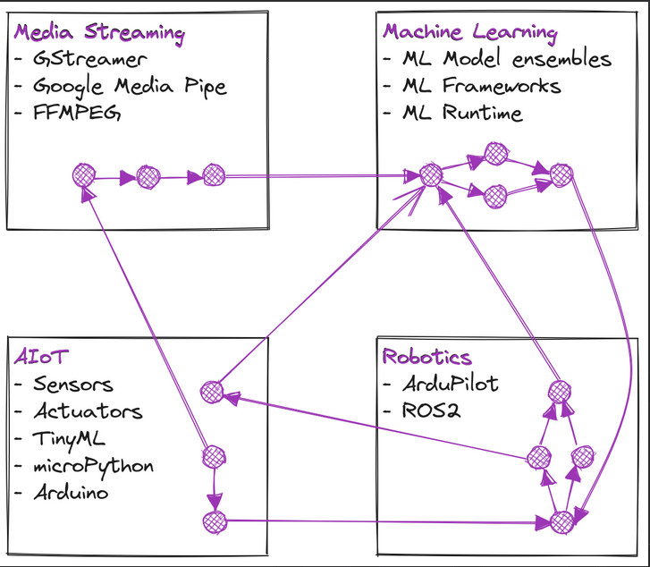

## Welcome !

### Working on

- [**Aiko Services**](https://github.com/geekscape/aiko_services) a distributed embedded framework, which integrates the domains of AIoT, Machine Learning, Media Streaming and Robotics

- [**Aiko Engine MP**](https://github.com/geekscape/aiko_engine_mp) an implementation of Aiko Services that supports embedded devices running [microPython](https://micropython.org)

### Projects

- [**AI + ML + Robots community group**](https://ai-ml-robots.github.io/) established 2016, rebooted August 2024

- [**Connected Community HackerSpace**](https://www.hackmelbourne.org) (CCHS) Melbourne, established March 2009

- [**Open Hardware MiniConference (OHMC)**](http://www.openhardwareconf.org) an annual hardware workshop, held at the [Linux Conference Australia](https://linux.org.au/linux-conf-au/) (LCA2010 - LCA2022) and then [Everything Open conference](https://everythingopen.au) (2023)

### Interests

- Embodied A.I and field robotics

- Operating systems, distributed and embedded systems and the [Actor Model](https://en.wikipedia.org/wiki/Actor_model)

- Influential programming languages: [LISP](https://en.wikipedia.org/wiki/Lisp_(programming_language)), [SmallTalk](https://en.wikipedia.org/wiki/Smalltalk) and more

- Intersection of software and hardware

<!--
- Blog: https://geekscape.github.io
- Presentations: YouTube, Slidedecks

- 🔭 I’m currently working on ...
- 🌱 I’m currently learning ...
- 👯 I’m looking to collaborate on ...
- 🤔 I’m looking for help with ...
- 💬 Ask me about ...
- 📫 How to reach me: ...
- 😄 Pronouns: ...
- ⚡ Fun fact: ...
-->
